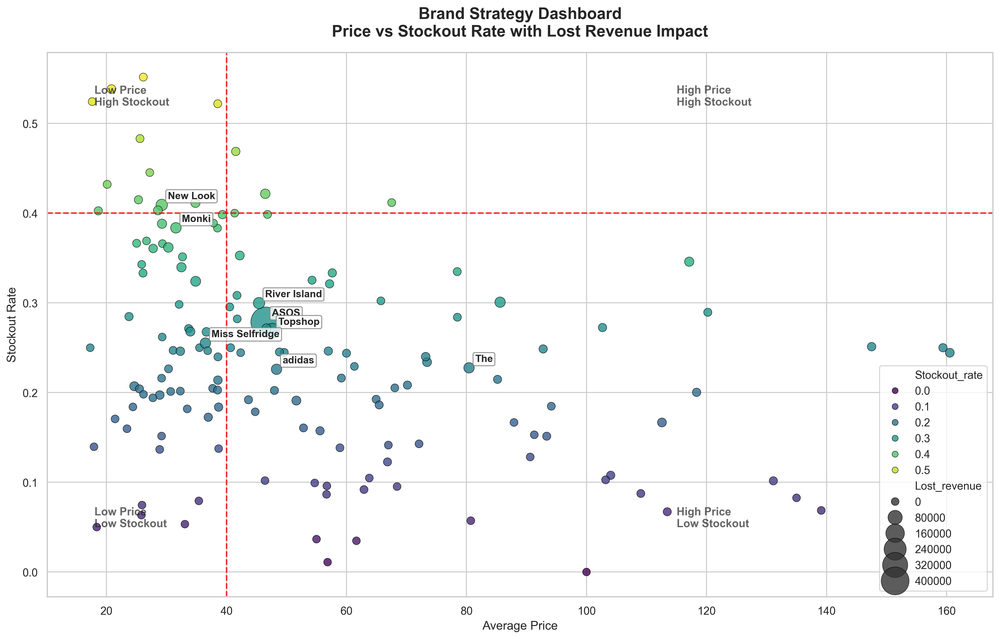

# ASOS Data Processing Analysis

## Dashboard Preview



---

## Project Overview

This project implements a Python pipeline for cleaning, analyzing, and visualizing e-commerce product data from an ASOS dataset.

The workflow focuses on data preprocessing, feature engineering, stockout metrics, lost revenue estimation, and brand-level strategy analysis.

---

## Features

- CSV data ingestion
- Data cleaning and preprocessing
- Price conversion and missing value handling
- Brand extraction from product descriptions
- Handling messy brand strings using simple text preprocessing
- Stockout count and stockout rate calculation
- Lost revenue estimation
- Brand-level aggregation and analysis
- Dashboard-style scatter plot visualization
- Export of processed data to CSV and JSON
- Modular project structure
- Basic unit testing

---

## Data Workflow

The data processing pipeline follows a structured workflow:

1. **Data Ingestion**
   - Load raw product dataset from CSV file
   - Handle parsing issues and malformed rows

2. **Data Cleaning**
   - Convert price values to numeric format
   - Remove missing or invalid entries
   - Standardize text fields (e.g., product descriptions)

3. **Brand Extraction & Processing**
   - Extract brand names from product descriptions
   - Handle inconsistent formats (e.g., "StradivariusThrow")
   - Normalize brand naming using mapping and preprocessing rules

4. **Feature Engineering**
   - Compute stockout count from size availability
   - Calculate stockout rate per product
   - Estimate lost revenue based on stockouts and price

5. **Data Filtering**
   - Remove low-frequency brands to ensure reliable analysis

6. **Aggregation & Analysis**
   - Group data by brand
   - Compute:
     - Average price
     - Average stockout rate
     - Total lost revenue
     - Number of products

7. **Visualization**
   - Generate a dashboard-style scatter plot:
     - X-axis: Average price
     - Y-axis: Stockout rate
     - Bubble size: Lost revenue
   - Highlight high-impact brands

8. **Output Generation**
   - Export cleaned dataset to CSV and JSON
   - Save aggregated analysis results
   - Save visualization as image

---

## Automation

The entire workflow is automated through a pipeline:

- A single entry point (`main.py`) executes all steps
- Modular scripts handle each stage (preprocessing, analysis, visualization)
- No manual intervention is required once the pipeline is triggered

This ensures reproducibility and consistency across runs.

---

## Key Insights

- Brands with **high price and high stockout rate** represent the highest revenue loss
- Larger bubbles indicate brands with significant financial impact
- The dashboard helps identify opportunities for inventory optimization and pricing strategies

---

## Project Structure

```
asos-data-processing-analysis/
├── data/
│   └── products_asos.csv
├── outputs/
│   ├── plots/
│   │   └── brand_strategy_dashboard.png
│   └── processed/
│       ├── asos_cleaned_data.csv
│       ├── asos_cleaned_data.json
│       └── brand_strategy.csv
├── src/
│   ├── __init__.py
│   ├── data_loader.py
│   ├── preprocessing.py
│   ├── analysis.py
│   ├── visualization.py
│   └── pipeline.py
├── tests/
│   ├── __init__.py
│   ├── test_preprocessing.py
│   └── test_analysis.py
├── notebooks/
│   └── exploration.ipynb
├── main.py
├── requirements.txt
├── README.md
└── .gitignore
```
---

## Installation

````bash
git clone https://github.com/oumaimabnz/asos-data-processing-analysis.git
cd asos-data-processing-analysis
python -m venv .venv

````
Activate the environment:

Windows:
```bash
.venv\Scripts\activate
```

macOS/Linux:
```bash
source .venv/bin/activate
```

Install dependencies:
```bash
pip install -r requirements.txt
```

---

## Run the Pipeline:
```bash
python main.py
```

---

## Run tests:
````bash
python -m pytest
````

---

## Outputs

The pipeline generates:

- cleaned dataset in CSV format
- cleaned dataset in JSON format
- brand strategy summary in CSV format
- dashboard-style brand strategy plot

---

## Dashboard overview

The final dashboard visualizes brand-level performance by combining:

- Average Price on the x-axis
- Stockout Rate on the y-axis
- Lost Revenue as bubble size
- Stockout intensity as bubble color

This makes it easier to identify high-impact brands that combine strong pricing with high stockout risk.

---

## Business Context

In e-commerce platforms, stockouts of high-demand products can lead to significant revenue loss. 
This project analyzes product availability and pricing data to identify brands with high stockout rates 
and estimate their potential revenue impact.

The goal is to support data-driven decisions for inventory optimization and pricing strategies.

---

## Technologies
- Python
- Pandas
- Matplotlib
- Seaborn
- Pytest


## Author
Oumaima Benaziza
